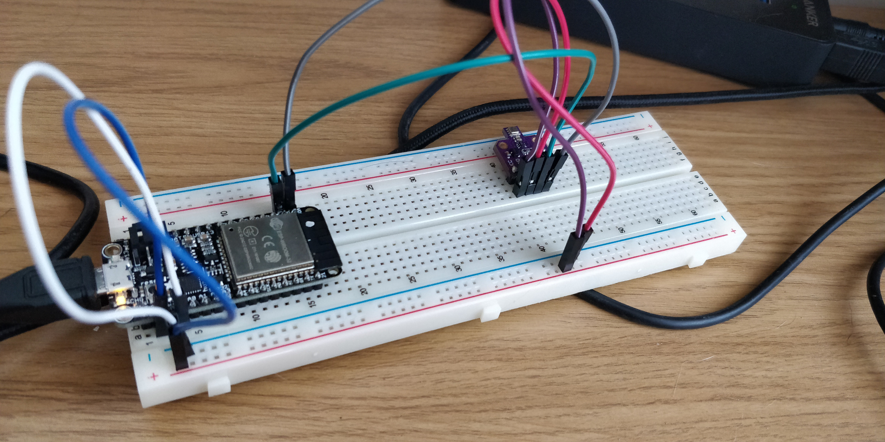

# MongooseOS based weather station

[View the station in realtime!](https://weather.sthn.io/)

[Frontend code](https://github.com/JoeSouthan/weather-station-firebase)

- Uses an ESP32 and a bme680 to record temperature, pressure, humidity and gas resistance
- Eventually will incorporate a PMS5003 PM2.5 sensor

Highly inspired by [alvarowolfx](https://github.com/alvarowolfx/weather-station-gcp-mongoose-os)'s project
